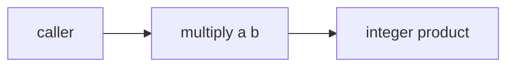

# Tech Spec: mini-calc

**Spec**: [spec.md](spec.md) | **Created**: 2026-09-08
**Every file/symbol citation below must come verbatim from [survey.md](survey.md)
or a grep run in this session — never from memory.**

## Architecture
One pure function joins the existing pair in `repo/calc.py`. Data flow is
trivial: operands in, integer product out, no state.

## Solution
### Chosen approach
A single pure function beside add/subtract, matching the module's
established two-operand integer style. Covers FR-001 directly; FR-002
falls out of integer multiplication, so no zero-guard branches exist.

### Alternatives rejected
| Alternative | Why rejected |
|-------------|--------------|
| Operator overloading on a Calculator class | No class exists in the module today — survey shows two bare functions |

## Impact analysis
Blast radius is zero callers today: the survey shows no symbol besides the
two tested functions, and the tests import functions directly. Nothing
existing changes; the addition is purely additive.

## Code guide
### Arithmetic module
- Touches: `repo/calc.py` — new function placed after the existing
  subtract definition (survey evidence: `repo/calc.py:sub:6`)
- Approach: a multiply function with the same two-operand shape as
  add/subtract, integer multiplication only
- Verify before implementing: `python3 -m pytest test_calc.py`
- Pitfalls: none known — integer-only module, no edge machinery

### Tests
- Touches: `repo/test_calc.py` — append tests beside the existing ones
  (survey evidence: `repo/test_calc.py:test_add:4`)
- Approach: one happy-path case, one zero-operand case, import style
  matching the existing `from calc import ...` line
- Verify before implementing: `python3 -m pytest test_calc.py`
- Pitfalls: keep tests at module level, matching the existing suite shape

## References
No external references — the researcher gate found no open questions;
research.md records the deliberate skip.

## Decisions
### D-001: Pure function, no class or operator surface
- **Context**: the spec needs multiply with the smallest change; the
  module today is two bare functions with direct-import tests.
- **Decision**: add a module-level multiply function; no Calculator class,
  no operator overloading.
- **Consequences**: a future expression parser will wrap the functions in
  a dispatch table; no migration cost now.
