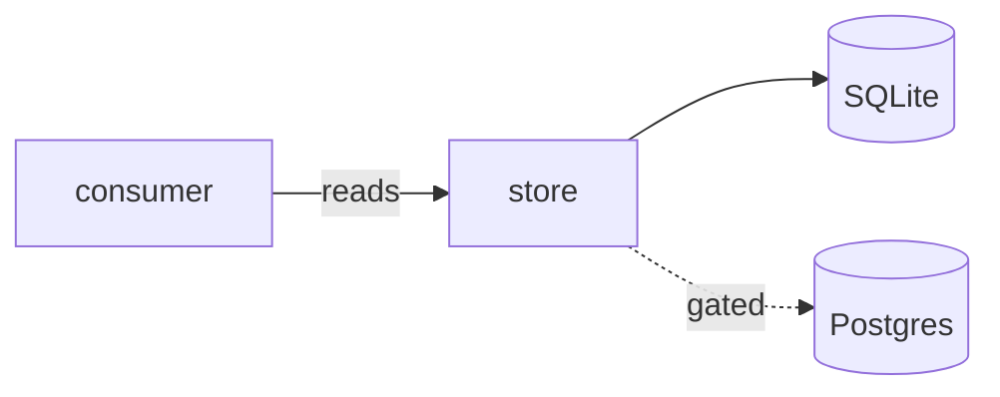
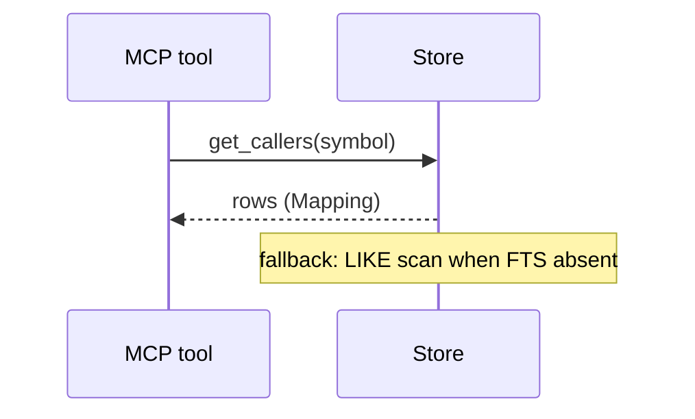
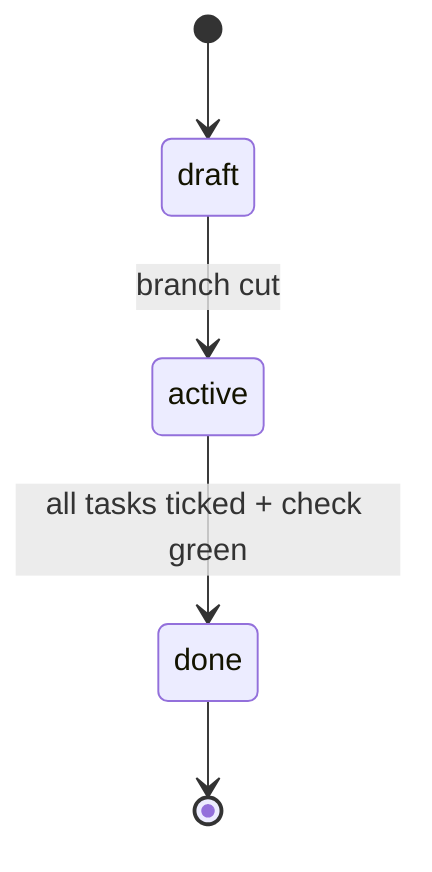
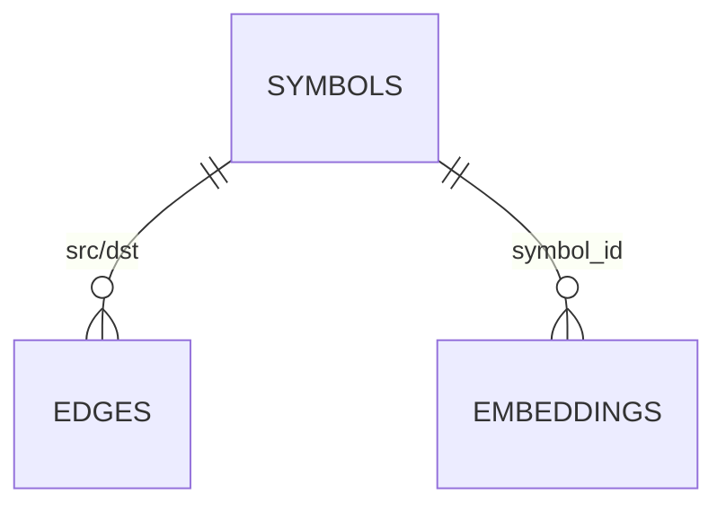

# Mermaid cheat-sheet (vendored — tech agent's diagram reference)

Write the diagram as a fenced ```mermaid block inside tech-spec.md. It is
documentation first: renders on GitHub/obsidian with zero tooling. Export to
PNG/SVG only if the repo demands image assets (then use the
creating-mermaid-diagrams skill, or `mmdc -i in.mmd -o out.svg` if
mermaid-cli is installed). Prefer simple over pretty: 6–12 nodes max.

## Component / data-flow (the default for § Architecture)



## Sequence (for request/ordering stories in § Solution or § Impact)



## State (for lifecycles: spec Status, task states, build pipeline)



## Entity relations (for schema/data-model areas in § Code guide)



## Conventions

- Direction `LR` for pipelines/flows, `TB` for org/hierarchy.
- Solid arrows = always-on paths; dotted (`-.->`) = gated/optional/fallback.
- Label edges with the verb of the relationship, not the field name.
- One diagram per concept — if you need a legend, split the diagram.
