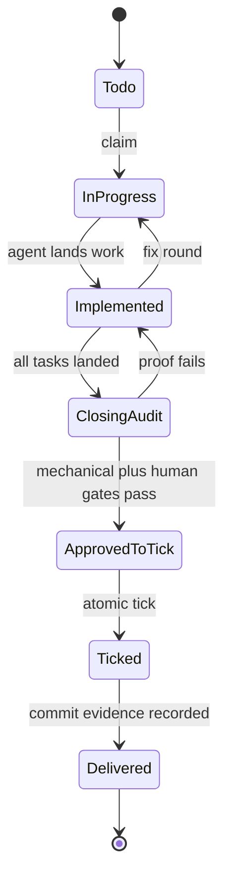

# Tech Spec: workflow-state-audit-safety

**Spec**: [spec.md](spec.md) | **Created**: 2026-09-21

## Architecture

The durable vocabulary is parsed once by specstate and consumed by graph,
audit, tick, and generated workflow adapters. Inspection evaluates markers and
dry mechanical facts only; proof execution is a separate explicit action.

## Solution
### Chosen approach
- Extend `skills/spec-to-prod/scripts/specstate.py:task_entries:136` with a
  backward-compatible implemented marker and closing/delivery header parsers.
- Update `skills/spec-to-prod/scripts/graph.py:task_frontier:282` so landed
  dependencies are satisfied without ticks.
- Keep `skills/spec-to-prod/scripts/graph.py:compute_state:963` pure by replacing
  live DoD execution with recorded/dry state evaluation.
- Make `skills/spec-to-prod/scripts/audit.py:mode_dod:355` distinguish mechanical
  readiness from recorded human completion.

### Alternatives rejected
| Alternative | Why rejected |
|-------------|--------------|
| Tick each task when code lands | Violates the all-at-once proof contract |
| Store landed state in spawn files | Violates C-01 and resume durability |
| Infer landing from git diff | Ambiguous for parallel and non-git work |

## Impact analysis
The blast radius is the state parser, graph oracle, audit scorecard, ticker,
workflow generators, role briefs, templates, and tests. Existing task files
without the new marker remain readable as todo/in-progress.

## Code guide
### State parsing
- Touches: `skills/spec-to-prod/scripts/specstate.py:task_entries:136`
- Approach: add typed task and header states with legacy defaults.
- Verify before implementing: `python3 skills/spec-to-prod/tests/test_specstate.py`
- Pitfalls: do not create a second status file.

### Graph and audit
- Touches: `skills/spec-to-prod/scripts/graph.py:compute_state:963`
- Approach: compute transitions without running proof commands.
- Verify before implementing: `python3 skills/spec-to-prod/tests/test_graph.py`
- Pitfalls: all report formats share the same inert state computation.

### Closing evidence
- Touches: `skills/spec-to-prod/scripts/audit.py:mode_dod:355`
- Approach: mechanical readiness and human approval are separate signals.
- Verify before implementing: `python3 skills/spec-to-prod/tests/test_audit.py`
- Pitfalls: process exit zero cannot stand in for human acknowledgment.

## References
- [survey.md](survey.md) — current parser, graph, and audit evidence.
- `skills/spec-to-prod/contracts/docset.md` — task.md lifecycle contract.

## Decisions
### D-001: Record landing separately from proof
- **Context**: implementation completes before plan-wide proof and ticking.
- **Decision**: task.md gains a durable implemented marker parsed by specstate.
- **Consequences**: dependencies advance without weakening the closing audit.

### D-002: Keep graph inspection inert
- **Context**: graph state is used by reports, UIs, and automation probes.
- **Decision**: no graph state path may execute repository-authored commands.
- **Consequences**: proof execution requires an explicit action and record.
