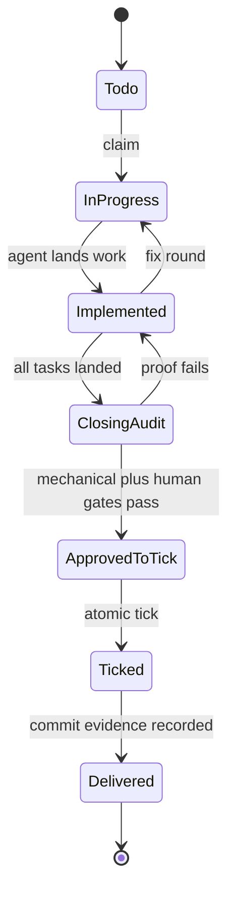

# Tech Spec: workflow-state-audit-safety

**Spec**: [spec.md](spec.md) | **Created**: 2026-09-21

## Architecture

The durable vocabulary is parsed once by specstate and consumed by graph,
audit, tick, and generated workflow adapters. Inspection evaluates markers and
dry mechanical facts only; proof execution is a separate explicit action.

## Solution
### Chosen approach
- Extend `skills/spec-to-prod/scripts/specstate.py:task_entries:136` with a
  backward-compatible implemented marker and closing/delivery header parsers.
- Update `skills/spec-to-prod/scripts/graph.py:task_frontier:282` so landed
  dependencies are satisfied without ticks.
- Keep `skills/spec-to-prod/scripts/graph.py:compute_state:963` pure by replacing
  live DoD execution with recorded/dry state evaluation.
- Make `skills/spec-to-prod/scripts/audit.py:mode_dod:355` distinguish mechanical
  readiness from recorded human completion.

### Alternatives rejected
| Alternative | Why rejected |
|-------------|--------------|
| Tick each task when code lands | Violates the all-at-once proof contract |
| Store landed state in spawn files | Violates C-01 and resume durability |
| Infer landing from git diff | Ambiguous for parallel and non-git work |

## Impact analysis
The blast radius is the state parser, graph oracle, audit scorecard, ticker,
workflow generators, role briefs, templates, and tests. Existing task files
without the new marker remain readable as todo/in-progress.

## Code guide
### State parsing
- Touches: `skills/spec-to-prod/scripts/specstate.py:task_entries:136`
- Approach: add typed task and header states with legacy defaults.
- Verify before implementing: `python3 skills/spec-to-prod/tests/test_specstate.py`
- Pitfalls: do not create a second status file.

### Graph and audit
- Touches: `skills/spec-to-prod/scripts/graph.py:compute_state:963`
- Approach: compute transitions without running proof commands.
- Verify before implementing: `python3 skills/spec-to-prod/tests/test_graph.py`
- Pitfalls: all report formats share the same inert state computation.

### Closing evidence
- Touches: `skills/spec-to-prod/scripts/audit.py:mode_dod:355`
- Approach: mechanical readiness and human approval are separate signals.
- Verify before implementing: `python3 skills/spec-to-prod/tests/test_audit.py`
- Pitfalls: process exit zero cannot stand in for human acknowledgment.

## References
- [survey.md](survey.md) — current parser, graph, and audit evidence.
- `skills/spec-to-prod/contracts/docset.md` — task.md lifecycle contract.

## Decisions
### D-001: Record landing separately from proof
- **Context**: implementation completes before plan-wide proof and ticking.
- **Decision**: task.md gains a durable implemented marker parsed by specstate.
- **Consequences**: dependencies advance without weakening the closing audit.

### D-002: Keep graph inspection inert
- **Context**: graph state is used by reports, UIs, and automation probes.
- **Decision**: no graph state path may execute repository-authored commands.
- **Consequences**: proof execution requires an explicit action and record.

### D-003: Chained waves spawn on landing evidence
- **Context**: graph.py's tick-based readiness cannot release `(after T###)`
  dependents mid-flight (the deadlock this spec removes); wave 1 landed
  T001/T004/T007/T008/T009 with all six skill suites green, re-verified by
  the orchestrator on the combined tree.
- **Decision**: per SKILL.md § Implementation ("chained tasks gate on
  landing, not on ticks"), the orchestrator spawns each dependent when the
  upstream digest plus scoped re-verification of its acceptance commands
  prove it landed; graph.py-touching tasks run serially (shared files).
- **Consequences**: the frontier stays the mechanical floor, never a veto;
  every landing is recorded `(implemented)` in `specs/001-workflow-state-audit-safety/task.md` before its dependents spawn.

### D-004: Frontier releases dependents on implemented upstreams
- **Context**: T002 made graph.py's `(after T###)` readiness accept
  `(implemented)` upstreams (FR-002); `skills/spec-to-prod/SKILL.md`'s
  "Chained tasks gate on landing" paragraph still described tick/struck-only
  readiness and its `(unticked)` blocked-reason, quoting the pre-plan
  deadlock this spec removes (CONSTITUTION C-02 drift).
- **Decision**: the SKILL.md paragraph is reconciled in-plan to state
  implemented/ticked/struck readiness; the orchestrator's scoped
  re-verification of acceptance commands remains the honesty guard for
  writing `(implemented)`, and the spawn-on-landing-evidence rule survives
  only for legacy docsets predating the marker.
- **Consequences**: manual frontier overrules stop being the normal path;
  a fabricated `(implemented)` marker becomes the new (equivalent) failure
  mode the re-verification guard deters.

### D-005: Node-table rows count implemented landing
- **Context**: T003 made execute complete on implemented/ticked/struck
  tasks (FR-003); `skills/spec-to-prod/SKILL.md`'s node-table `execute`
  done-when row and the per-task-frontier paragraph still described
  tick/struck-only completion and readiness (CONSTITUTION C-02 drift,
  same class as D-004).
- **Decision**: both rows are reconciled in-plan to implemented/ticked/
  struck landing, matching the code and D-004's paragraph.
- **Consequences**: the SKILL.md graph contract now names all three
  landed states; audit.py's DoD gate 4 (ticked-only completeness) remains
  the audit-side surface T006 reconciles for durable closing approval.

### D-006: Closing-audit probe is in-process and inert
- **Context**: T005 deleted graph.py's run_dod live-DoD subprocess (FR-004)
  and made compute_state consume audit.classify_proofs in-process;
  `skills/spec-to-prod/SKILL.md`'s in-process-recipe note still described
  all three internal probes as shelling out via subprocess (CONSTITUTION
  C-02 drift, same class as D-004/D-005).
- **Decision**: the note is reconciled in-plan — survey/verify probes stay
  subprocess-isolated; the closing-audit probe classifies in-process and
  never executes.
- **Consequences**: state computation has no execution path at all;
  T006's recorded-approval parsing is load-bearing for the closing-audit
  node's done transition.

### D-007: DoD completeness counts the landed vocabulary
- **Context**: T006 reported (and T003's routing note anticipated) that
  audit.py's DoD gate 4 demanded `done == total` ticked-only — never
  literally satisfiable at closing-audit time, where ticks are forbidden,
  so the audit-side deadlock FR-003/FR-005 removed graph-side survived;
  SKILL.md's closing-audit done-when cell still cited the dod scorecard
  as the transition condition (C-02 drift, D-004/D-005/D-006 class).
- **Decision**: orchestrator-reconciled in-plan — gate 4 now passes when
  every task is ticked, `(implemented)`, or struck with none in-progress
  (detail line reports both ticked and landed counts; `gates/dod.md` row
  and the SKILL.md cell now name the durable `Closing-audit: approved @ sha-or-dash` record as the transition); tick-completeness remains
  tick-commit's check.py burndown gate. The task.md template's
  `**Closing-audit**:` placeholder line is routed to T010 (templates are
  its named scope).
- **Consequences**: `audit.py dod` is all-green-reachable at closing time;
  the human sign-off (gate 10) stays the only non-mechanical bar;
  a `(fix 5/5)` at-cap task counts not-landed, preserving the cap's bite.

### D-008: Tick-commit's done citation is the Delivered record
- **Context**: T010 made tick-commit's git branch consume specstate's
  `Delivered: commit @ <sha>` record (FR-006); SKILL.md's tick-commit
  done-when cell named neither the proof-note requirement nor the record,
  and `commands/ship.md` (the node's actor) performed the plan commit
  without ever writing the record — tick-commit could never read done in
  a git repo (C-02 drift, D-004..D-007 class).
- **Decision**: orchestrator-reconciled in-plan — the SKILL.md cell now
  names proof notes + burndown + the Delivered record (dash form only
  non-git); ship.md gained the record step after the plan commit, before
  the rulings report.
- **Consequences**: /ship's checklist closes the loop the graph gates on;
  the delivery sha is durable task.md state, re-readable on resume.
