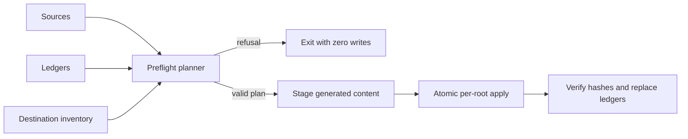

# Tech Spec: provenance-safe-installation

**Spec**: [spec.md](spec.md) | **Created**: 2026-09-21

## Architecture

One planner classifies every destination as create, owned-update,
owned-delete, unchanged, or refuse before any mutation. Generators produce
staging content; they do not decide ownership.

## Solution
### Chosen approach
- Reuse the hash/path semantics at `tools/sync.sh:105`
  for every artifact class.
- Refactor the installation flow at `tools/sync.sh:172` to consume a complete plan
  rather than running rsync after a stale-only sweep.
- Make `tools/agent-defs.py:main:157` render to staging and remove prefix deletion.
- Extend `tools/workflow-defs.py:main:739` or a shared helper to emit correctly
  escaped workflow string literals.

### Alternatives rejected
| Alternative | Why rejected |
|-------------|--------------|
| Treat identical unledgered files as owned | Silently adopts another installer’s file |
| Keep prefix cleanup with a narrower glob | Naming is not provenance |
| Continue raw rsync and repair afterward | Data loss has already occurred |

## Impact analysis
All global and project install roots are affected. Destination paths and file
formats remain unchanged; only collision, staging, and deletion semantics
change. Tests must use temporary homes and include rollback assertions.

## Code guide
### Install planning
- Touches: `tools/sync.sh:172`
- Approach: inventory all roots and fail before the first write.
- Verify before implementing: `python3 tools/tests/test_sync.py`
- Pitfalls: a late optional-harness collision must not partially update core roots.

### Agent generation
- Touches: `tools/agent-defs.py:main:157`
- Approach: pure render into staging; installer owns cleanup and deployment.
- Verify before implementing: `python3 tools/tests/test_agent_defs.py`
- Pitfalls: never delete by `spec-` or any inferred prefix.

### Workflow paths
- Touches: `tools/workflow-defs.py:main:739`
- Approach: encode resolved paths as language literals.
- Verify before implementing: `python3 tools/tests/test_workflow_defs.py`
- Pitfalls: cover ampersands, pipes, quotes, backslashes, whitespace, and dollar syntax.

## References
- [survey.md](survey.md) — current install and generation behavior.
- `specs/CONSTITUTION.md` C-02 — generated artifacts require one source and drift checks.

## Decisions
### D-001: Provenance is hash plus relative path
- **Context**: name and content equality do not prove ownership.
- **Decision**: only a matching ledger entry authorizes replacement or deletion.
- **Consequences**: previously unledgered installs require an explicit migration choice.

### D-002: Plan completely before applying
- **Context**: multi-root sync can otherwise fail after earlier roots changed.
- **Decision**: preflight all roots and generated content before mutation.
- **Consequences**: installation has an extra read/staging pass but predictable failure semantics.

### D-003: Chained waves spawn on landing evidence
- **Context**: graph.py's tick-based readiness cannot release `(after T###)`
  dependents mid-flight; wave 1 landed T001/T004/T005/T008 with the four
  tools suites green, re-verified by the orchestrator on the combined tree.
- **Decision**: per SKILL.md § Implementation, the orchestrator spawns each
  dependent when the upstream digest plus scoped re-verification prove it
  landed; same-file tasks run serially, disjoint tasks share a round.
- **Consequences**: the frontier stays the mechanical floor; every landing
  is recorded `(implemented)` in `specs/002-provenance-safe-installation/task.md` before its dependents spawn.

### D-004: agy provenance is git plus byte-compare
- **Context**: T006 found agy personas are committed regenerate-only repo
  content — a `.spec-dev-kit-deployed` ledger inside the repo would be a
  new committed artifact class that refuses the repo's own ledger-less
  personas on first post-change sync.
- **Decision**: git history plus sync.sh's byte-compare against a fresh
  render IS agy's provenance authority; a file ledger there is deferred
  with the spec's explicit-adoption migration question.
- **Consequences**: agy drift stays visible as a working-tree diff; no
  foreign-collision exposure exists for committed content beyond git's
  own guarantees.

### D-005: OMP's per-skill manifest is a provenance ledger
- **Context**: T006 aligned OMP writes through the shared planner but kept
  `.spec-dev-kit-omp-defs-<skill>` as that root's ledger — a shared
  `.spec-dev-kit-deployed` has no per-skill attribution, which OMP's
  per-skill stale-deletion scoping requires.
- **Decision**: D-001's contract is hash-plus-relative-path entry
  semantics, not the filename; the per-skill manifest satisfies it with
  one planner implementation behind both.
- **Consequences**: classify semantics are identical across roots; a
  future unified ledger needs a migration decision, recorded here.

### D-006: Atomic apply spans the whole installer path
- **Context**: T007 extended FR-007's destination-local temp + atomic
  replace beyond sync.sh to `tools/install-workflow.sh` (the workflow arm
  of the shared installer path); all installer scratch carries the
  `.spec-dev-kit-deployed` prefix — the namespace sweep_tree,
  record_tree, verify_tree, and `ownership.inventory()` already exclude —
  so crash leftovers stay inert instead of reading as foreign files.
  The residual it observed (omp-defs.py write_manifest direct
  write_text) is reconciled in-plan by the orchestrator: manifest now
  stages to a destination-local temp and os.replace's into place, the
  same pattern its content writes use.
- **Decision**: accepted scope reading; two small per-file shell helpers
  mirror the pre-existing ledger_record duplication rather than
  introducing a sourced lib mid-plan.
- **Consequences**: every content and ledger write in the installer path
  is now an atomic rename; a torn write can no longer leave a partial
  ledger or file.

### D-007: Bounded proof corpus, parallel test fan-out
- **Context**: the closing audit's 120s per-command proof cap TIMEOUTed
  on `tools/tests/test_sync.py` (24/24 OK but 520s wall): every test
  copytree'd the whole repo and every sync hashed the full skill tree
  across 4 roots. Corpus bounding alone measured 188s serial — the floor
  is sync.sh's ~34 python-tool spawns per invocation, corpus-independent.
- **Decision**: closing-audit fix round per the timeout rule's
  "bound the corpus" path — setUp materializes exactly what sync.sh
  consumes (no assertion weakened, none removed), and the suite's
  `__main__` fans the 24 order-independent cases across a spawn-context
  Pool with a serial fallback (`python3 -m unittest` still works).
  Measured 50.7s wall (uvx python 3.12: 51.3s).
- **Consequences**: proofs fit the audit cap with margin; a future test
  that depends on execution order must opt into serial; if sync.sh's
  spawn floor grows, revisit the per-invocation spawn count, not the cap.

### D-008: Human records govern the closing transition on pre-001 tooling
- **Context**: at tick-commit, this branch's shipped graph.py/audit.py
  (pre-001) probe `dod` live and require exit 0 for closing-audit done;
  gates 6/7 here are FAIL-but-ruled (3 directory-named deliverables the
  literal-path grep cannot see; 20 CLI-output/report-line suspects) and
  the old code has no ruled channel — the exact mechanical/human state
  conflation spec 001 removes graph-side.
- **Decision**: delivered on the human records (approval, full closing
  report 2026-09-21, user ack "ack both") with ticks, burndown,
  Closing-audit and Delivered records in task.md; the branch-level graph
  reading stays blocked until this branch merges with 001's delivered
  contract, which reads the same records correctly.
- **Consequences**: no tooling change lands inside 002's scope diff; the
  as-built task.md is authoritative; spec 004's CI drift gate covers the
  tooling/docset agreement class going forward.
