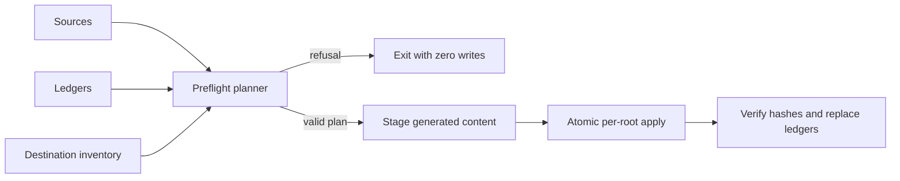

# Tech Spec: provenance-safe-installation

**Spec**: [spec.md](spec.md) | **Created**: 2026-09-21

## Architecture

One planner classifies every destination as create, owned-update,
owned-delete, unchanged, or refuse before any mutation. Generators produce
staging content; they do not decide ownership.

## Solution
### Chosen approach
- Reuse the hash/path semantics at `tools/sync.sh:105`
  for every artifact class.
- Refactor the installation flow at `tools/sync.sh:172` to consume a complete plan
  rather than running rsync after a stale-only sweep.
- Make `tools/agent-defs.py:main:157` render to staging and remove prefix deletion.
- Extend `tools/workflow-defs.py:main:739` or a shared helper to emit correctly
  escaped workflow string literals.

### Alternatives rejected
| Alternative | Why rejected |
|-------------|--------------|
| Treat identical unledgered files as owned | Silently adopts another installer’s file |
| Keep prefix cleanup with a narrower glob | Naming is not provenance |
| Continue raw rsync and repair afterward | Data loss has already occurred |

## Impact analysis
All global and project install roots are affected. Destination paths and file
formats remain unchanged; only collision, staging, and deletion semantics
change. Tests must use temporary homes and include rollback assertions.

## Code guide
### Install planning
- Touches: `tools/sync.sh:172`
- Approach: inventory all roots and fail before the first write.
- Verify before implementing: `python3 tools/tests/test_sync.py`
- Pitfalls: a late optional-harness collision must not partially update core roots.

### Agent generation
- Touches: `tools/agent-defs.py:main:157`
- Approach: pure render into staging; installer owns cleanup and deployment.
- Verify before implementing: `python3 tools/tests/test_agent_defs.py`
- Pitfalls: never delete by `spec-` or any inferred prefix.

### Workflow paths
- Touches: `tools/workflow-defs.py:main:739`
- Approach: encode resolved paths as language literals.
- Verify before implementing: `python3 tools/tests/test_workflow_defs.py`
- Pitfalls: cover ampersands, pipes, quotes, backslashes, whitespace, and dollar syntax.

## References
- [survey.md](survey.md) — current install and generation behavior.
- `specs/CONSTITUTION.md` C-02 — generated artifacts require one source and drift checks.

## Decisions
### D-001: Provenance is hash plus relative path
- **Context**: name and content equality do not prove ownership.
- **Decision**: only a matching ledger entry authorizes replacement or deletion.
- **Consequences**: previously unledgered installs require an explicit migration choice.

### D-002: Plan completely before applying
- **Context**: multi-root sync can otherwise fail after earlier roots changed.
- **Decision**: preflight all roots and generated content before mutation.
- **Consequences**: installation has an extra read/staging pass but predictable failure semantics.
