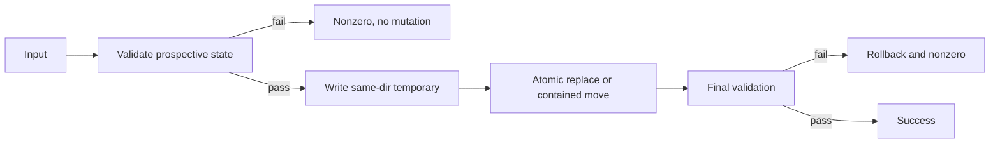

# Tech Spec: Transactional lifecycle tools

**Spec**: [spec.md](spec.md) | **Created**: 2026-09-21

## Architecture

Mutation commands validate before writing and retain enough state to restore failed finalization.

## Solution
### Chosen approach
Split tick into a pure prospective transform and same-directory durable replacement (FR-001, FR-002). Validate archive identity canonically before a move and journal it until index and final validation succeed (FR-003, FR-004).

### Alternatives rejected
| Alternative | Why rejected |
|-------------|--------------|
| In-place edits with best-effort repair | Interruption can leave unparseable state. |
| Lexical archive prefix checks | Symlinks and normalized traversal can escape them. |

## Impact analysis
`skills/spec-to-prod/scripts/tick.py:main:60` gains a transaction boundary and consumes a pure burndown transform at `skills/spec-to-prod/scripts/check.py:main:492`. `skills/spec-to-prod/scripts/archive.sh:7` gains canonical containment and rollback.

## Code guide
### Atomic tick
- Touches: `main` in `skills/spec-to-prod/scripts/tick.py` and `main` in `skills/spec-to-prod/scripts/check.py`.
- Approach: compute in memory, write beside target, fsync, replace, and validate.
- Verify before implementing: `python3 skills/spec-to-prod/tests/test_tick.py && python3 skills/spec-to-prod/tests/test_check.py`
- Pitfalls: the original file must remain byte-identical on every failure.

### Contained archive
- Touches: `skills/spec-to-prod/scripts/archive.sh:7`.
- Approach: validate canonical direct-child identity, journal the move, then finalize or restore.
- Verify before implementing: `bash -n skills/spec-to-prod/scripts/archive.sh`
- Pitfalls: temporary and rollback paths must remain inside canonical roots.

## References
- [survey.md](survey.md) — current mutation boundaries.
- [Spec 001](../001-workflow-state-audit-safety/spec.md) — upstream state grammar.

## Decisions
### D-001: Mutation is a transaction
- **Context**: Lifecycle state must survive interruption and failed postconditions.
- **Decision**: Validate first, promote atomically, and retain rollback state through final validation.
- **Consequences**: In-place partial updates are forbidden.

### D-003: Chained waves spawn on landing evidence
- **Context**: wave 1 landed T001/T002 (tick transform + failure matrix)
  and T004/T005 (archive containment + rollback journal); the tick
  failure matrix is red x4 by design until T003 lands the transaction.
- **Decision**: per SKILL.md § Implementation the orchestrator spawns
  T003 (after T001+T002) and T006 (after T004+T005) on the digests plus
  scoped re-verification; landings recorded `(implemented)` in
  `specs/003-transactional-lifecycle-tools/task.md`.
- **Consequences**: the frontier stays the mechanical floor; T003 turns
  the matrix green and the closing audit re-runs the full acceptance set.
### D-004: Tick refuses unattributable burndown arithmetic
- **Context**: T001's stricter contract — prospective burndown rows that
  cannot be attributed to a phase (e.g. ad-hoc `| Setup | 1 | 0 |`) now
  exit 1 with nothing written; previously tick wrote and left check.py
  red.
- **Decision**: refusal-before-write is the FR-001 reading; the
  table-less task.md case stays a WARN-and-proceed.
- **Consequences**: a task.md needing burndown repair must fix the table
  (check.py --fix-burndown) before ticking; no silent inconsistent state.
