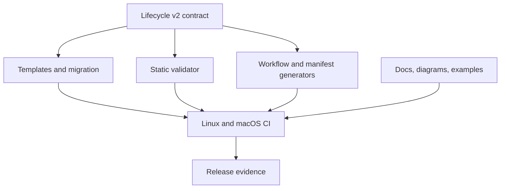

# Tech Spec: Contract, documentation, and release validation

**Spec**: [spec.md](spec.md) | **Created**: 2026-09-21

## Architecture

One versioned contract drives authored templates, migration, static validation, generated outputs, documentation, and release gates.

## Solution
### Chosen approach
Add explicit lifecycle v2 markers and a dry-run/idempotent migration (FR-001, FR-002). Extend static validation to enforce both requirement and acceptance-criterion coverage (FR-003). Add a two-platform CI matrix and deterministic drift checks (FR-004, FR-006). Reconcile public docs and release metadata only after those gates pass (FR-005, FR-007).

### Alternatives rejected
| Alternative | Why rejected |
|-------------|--------------|
| Silent interpretation of legacy markers | Hides ambiguity and can fabricate approval. |
| Documentation-only correction | Does not prevent future drift. |
| Single-platform CI | Cannot support portability claims. |

## Impact analysis
`skills/spec-to-prod/scripts/check.py:main:492` becomes the traceability enforcement boundary. `tools/workflow-defs.py:main:795` and `tools/plugin-manifest.py:main:116` supply deterministic generated surfaces. `README.md:1` and `skills/spec-to-prod/SKILL.md:1` must state only behavior proved by CI.

## Code guide
### Contract and migration
- Touches: templates, contract, checker, migration utility, and legacy fixtures.
- Approach: add lifecycle version and pending-only evidence fields; make preview/apply deterministic and idempotent.
- Verify before implementing: `python3 skills/spec-to-prod/tests/test_check.py`
- Pitfalls: never convert missing legacy evidence into passed evidence.

### Generation and release gates
- Touches: `main` in `tools/workflow-defs.py`, `main` in `tools/plugin-manifest.py`, CI, docs, diagrams, examples, and version files.
- Approach: regenerate from canonical sources and fail when a second generation changes the tree.
- Verify before implementing: `python3 tools/workflow-defs.py --check && python3 tools/plugin-manifest.py --check`
- Pitfalls: generated files must not become competing sources of truth.

## References
- [survey.md](survey.md) — current validator, generator, and documentation boundaries.
- [Spec 001](../001-workflow-state-audit-safety/spec.md), [Spec 002](../002-provenance-safe-installation/spec.md), [Spec 003](../003-transactional-lifecycle-tools/spec.md) — behavior frozen before release reconciliation.

## Decisions
### D-001: Legacy evidence is never inferred
- **Context**: New fields cannot prove past human or mechanical actions.
- **Decision**: Migration creates explicit pending markers and actionable warnings only.
- **Consequences**: Existing active specs require a one-time acknowledgement flow.

### D-002: Support claims follow CI evidence
- **Context**: Portability statements without repeatable execution are misleading.
- **Decision**: Name only platforms and harnesses exercised by release gates.
- **Consequences**: New support requires adding CI evidence first.
