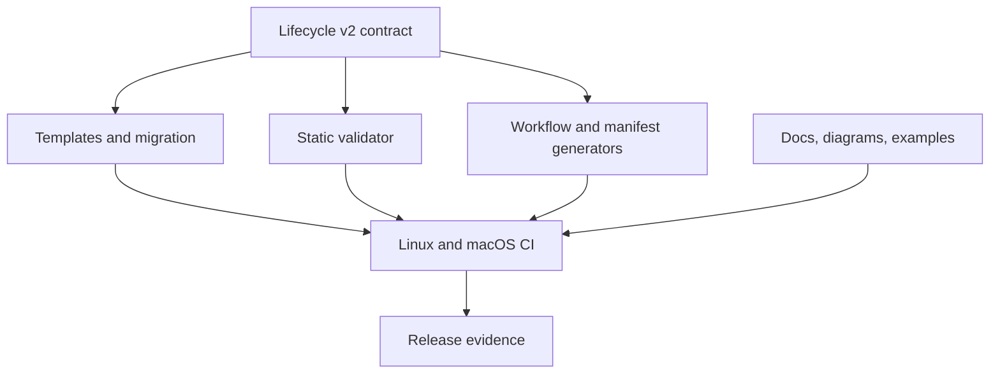

# Tech Spec: Contract, documentation, and release validation

**Spec**: [spec.md](spec.md) | **Created**: 2026-09-21

## Architecture

One versioned contract drives authored templates, migration, static validation, generated outputs, documentation, and release gates.

## Solution
### Chosen approach
Add explicit lifecycle v2 markers and a dry-run/idempotent migration (FR-001, FR-002). Extend static validation to enforce both requirement and acceptance-criterion coverage (FR-003). Add a two-platform CI matrix and deterministic drift checks (FR-004, FR-006). Reconcile public docs and release metadata only after those gates pass (FR-005, FR-007).

### Alternatives rejected
| Alternative | Why rejected |
|-------------|--------------|
| Silent interpretation of legacy markers | Hides ambiguity and can fabricate approval. |
| Documentation-only correction | Does not prevent future drift. |
| Single-platform CI | Cannot support portability claims. |

## Impact analysis
`skills/spec-to-prod/scripts/check.py:main:492` becomes the traceability enforcement boundary. `tools/workflow-defs.py:main:795` and `tools/plugin-manifest.py:main:116` supply deterministic generated surfaces. `README.md:1` and `skills/spec-to-prod/SKILL.md:1` must state only behavior proved by CI.

## Code guide
### Contract and migration
- Touches: templates, contract, checker, migration utility, and legacy fixtures.
- Approach: add lifecycle version and pending-only evidence fields; make preview/apply deterministic and idempotent.
- Verify before implementing: `python3 skills/spec-to-prod/tests/test_check.py`
- Pitfalls: never convert missing legacy evidence into passed evidence.

### Generation and release gates
- Touches: `main` in `tools/workflow-defs.py`, `main` in `tools/plugin-manifest.py`, CI, docs, diagrams, examples, and version files.
- Approach: regenerate from canonical sources and fail when a second generation changes the tree.
- Verify before implementing: `python3 tools/workflow-defs.py --check && python3 tools/plugin-manifest.py --check`
- Pitfalls: generated files must not become competing sources of truth.

## References
- [survey.md](survey.md) — current validator, generator, and documentation boundaries.
- [Spec 001](../001-workflow-state-audit-safety/spec.md), [Spec 002](../002-provenance-safe-installation/spec.md), [Spec 003](../003-transactional-lifecycle-tools/spec.md) — behavior frozen before release reconciliation.

## Decisions
### D-001: Legacy evidence is never inferred
- **Context**: New fields cannot prove past human or mechanical actions.
- **Decision**: Migration creates explicit pending markers and actionable warnings only.
- **Consequences**: Existing active specs require a one-time acknowledgement flow.

### D-002: Support claims follow CI evidence
- **Context**: Portability statements without repeatable execution are misleading.
- **Decision**: Name only platforms and harnesses exercised by release gates.
- **Consequences**: New support requires adding CI evidence first.

### D-003: Chained waves spawn on landing evidence
- **Context**: wave 1 landed T001-T005 and T007-T008 (7 of 9 tasks);
  T006 (after T004+T005) and T009 (after T007+T008) remain chained.
- **Decision**: per SKILL.md § Implementation the orchestrator spawns
  T006 and T009 serially on the digests plus scoped re-verification
  (phase order: CI/drift before release reconciliation); landings
  recorded `(implemented)` in
  `specs/004-contract-docs-release-validation/task.md`.
- **Consequences**: the frontier stays the mechanical floor; the closing
  audit re-runs the full acceptance set.
### D-004: Migration refuses non-active docsets
- **Context**: T002's conservative reading of FR-002's "version 1 active
  docset" — migrate.py refuses Status other than draft/active and any
  specs/archive/ path, so done plans and archived history are never
  rewritten (their evidence records are historical facts).
- **Decision**: ratified — the migration surface is for upgrading
  in-flight docsets only; archived docsets stay readable with the
  compatibility warning per US1-AC2.
- **Consequences**: no `done` docset can gain pending markers by tooling;
  a forced migration of a done docset requires un-archiving first (manual,
  human-gated).
### D-005: Drift canonical sources without committed generators
- **Context**: T005's FR-006 design — two of the four generated surfaces
  have no committed generator script: diagram HTML renders (the .mmd
  model is the artifact) and the example docset (a fixture, not output).
- **Decision**: diagrams are enforced against scripts/graph.py's own graph
  contract (NODES/edges) plus render node-coverage; examples against the
  mini-spec fixture staying check.py-green. Manifests and workflows keep
  their real generators (plugin-manifest.py, workflow-defs.py).
- **Consequences**: drift-check.py covers all four surfaces; a future
  committed diagram generator would replace the contract-import leg.
### D-006: Cross-task reconciliations at the wave boundary
- **Context**: T007's SKILL.md body edit landed after T008's manifest
  regeneration (plugin.json DRIFT at wave close — regenerated by the
  orchestrator, --check exit 0); T007 referenced the migration utility
  generically and the README lacked a pointer to T008's RELEASE.md.
- **Decision**: orchestrator-reconciled in-plan: README names
  migrate.py explicitly and links RELEASE.md from § Development.
- **Consequences**: generated surfaces in sync at close; every doc claim
  resolves to a literal path or gate.
