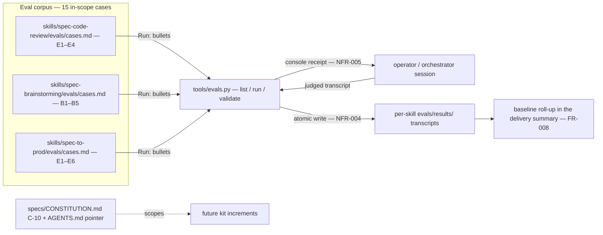

# Tech Spec: kit-level-up

**Spec**: [spec.md](spec.md) | **Created**: 2026-10-04
**Every file/symbol citation below must come verbatim from [survey.md](survey.md)
or a grep run in this session — never from memory.**

## Architecture

Today (survey evidence): the three case files exist with 15 case headings
(spec-code-review E1–E4, spec-brainstorming B1–B5, spec-to-prod E1–E6), no
results transcript exists anywhere (`find skills -type f -path '*evals/results/*'
| wc -l` → 0), `tools/` holds ten entries and none is an eval runner, and the
eval surfaces are drift-unguarded (drift-check/ownership mention neither
"evals" nor "cases.md"). Each case file already states its own judging rule
(a failed criterion is a finding; never average — survey FR-002 evidence).

The feature adds exactly one executable component — a stdlib-only runner at
`tools/evals.py` — plus data and governance around it: a `Run:` bullet per
case (the single source of truth for how the case executes, FR-006), a
per-skill results directory holding the recorded evidence (FR-001), the
C-10 scoping article with its `AGENTS.md` pointer (FR-007), and the baseline
roll-up in the delivery summary (FR-008). The runner is a file-reader and
recorder, never a judge: conversational cases (all 15 in scope today) are
judged by the orchestrator session running them — the spec's own assumption —
and the runner owns the listing, the mechanical execute path, and the
recording half of the conversational path.

## Solution
### Chosen approach
One runner, three modes, data-driven classification (FR-004, FR-005):

- `list` — discovers every `cases.md` under `skills/*/evals/cases.md` (D-004),
  parses `## <ID> — <title>` headings and each case's `**Run**` bullet, and
  prints case selector, kind, and source file. Reads case files only — no
  subprocess, no agent (NFR-003).
- `run <case>` — executes a mechanical case's `Run` value as a shell command,
  records the results file, exits nonzero on a failed criterion (FR-004).
- `validate <case> <transcript>` — for conversational cases: without a
  transcript argument it prints the case's session procedure; with one it
  checks recording completeness (every enumerated pass criterion carries a
  verdict plus transcript evidence) and files the verdict at the results path
  (FR-005, D-005).

Kind classification is data-driven from the `Run` line itself (D-001): a value
starting with `session:` marks a conversational case; any other value is the
mechanical command. Case selector grammar: `<skill-dir>/<case-id>` (for
example `spec-code-review/e2`), since bare case ids collide across skills
(E1–E4 exist in two skills). Results land at
`skills/<skill>/evals/results/<date>-<case-id>.md` in D-002's shape, written
atomically and never clobbered without an explicit flag (D-003, NFR-004).

FR coverage: FR-001/002/003 → the baseline pass produces the results files in
D-002's shape (findings aggregated per criterion, contract bents recorded as
kill-criterion findings); FR-004/005 → the runner's run and validate modes;
FR-006 → the `Run:` bullets; FR-007 → C-10 + pointer; FR-008 → the roll-up
block under the Delivered header in `specs/kit-level-up/task.md`;
NFR-003/004/005 → the list path, the write discipline, and the console
receipt respectively.

Scope note: survey.md's FR-001 gap ("unknown — verify which spec-to-prod
cases are in scope") was written against an earlier spec revision; the
current spec.md names all six spec-to-prod standing cases — 15 cases total —
matching the survey's own re-counted case inventory (4 + 5 + 6). The full set
is in scope.

### Alternatives rejected
| Alternative | Why rejected |
|-------------|--------------|
| Hardcode the three skill names in the runner | a fourth skill would be invisible to `list` — glob discovery keeps the tool harness-neutral (D-004) |
| Judge criteria semantics inside the runner | stdlib-only code cannot judge prose, and the spec's own assumption reserves judging for the observing session (D-005) |
| Restructure Pass criteria into per-criterion sub-bullets for robust parsing | exceeds FR-006's single-bullet addition; the spec pins criteria ambiguity as a finding, not a runner bug (D-002) |
| Run the baseline before building the runner | the runner is the recording instrument — running first recreates the session archaeology US2 exists to kill |
| A generated kit-level roll-up view | the spec's Out list defers it until the corpus grows; FR-008's delivery-summary record is the deliverable |
| A JSON/SQLite results store | transcripts are in-repo markdown evidence — that is the credibility the business value names (and NFR-002 keeps them local) |

## Impact analysis
<!-- Blast radius grounded in survey evidence; session greps marked. -->

- **New surface, zero existing callers.** `tools/evals.py` does not exist
  (survey FR-004: `ls` absent; tools/ inventory lists ten other entries). A
  session grep for `evals.py` matches only spec docs and spawn payloads — no
  code references it. Nothing existing breaks if the runner is wrong.
- **Case files: no code consumers today.** Survey: no test file in
  `skills/*/tests/` or `tools/tests/` references cases.md, and drift-check/
  ownership mention neither "evals" nor "cases.md" — the `Run:` additions
  (FR-006) break no test and no drift guard. A session grep for
  `evals/cases.md` matches docs only (brainstorm, SKILL.md, CHANGELOGs,
  observations, example READMEs, spec docs). The runner becomes their first
  machine consumer: a malformed `Run` bullet surfaces as a list-mode parse
  failure, which is the visible guard.
- **Default-flip sweep: not applicable.** No decision here flips an existing
  flag, keyword, or return shape — the whole surface is additive, so the
  flag-pin / exact-count-pin / exact-traffic-pin test classes have nothing to
  sweep. Nearest coupling: T022 edits `specs/kit-level-up/task.md`, which
  check.py parses (survey cites the machinery at
  `skills/spec-to-prod/scripts/check.py:survey_only_check:278`) — the roll-up
  block must not add checkbox lines or touch the three-column burndown table.
- **C-10 blast radius.** check.py's constitution gate reads presence/fill
  only, not article contents — appending C-10 cannot fail it. `AGENTS.md:54`
  documents the current article range (survey FR-007 evidence); the pointer
  line lands beside that range. No other file references C-10 today (survey:
  rg no match).

## Quality, threats, and rollback
<!-- Map every applicable NFR-### to a concrete design consequence. For
     external input, auth, persistence, migration, or privileged operation,
     record a compact threat model and rollback/recovery strategy. -->
| Requirement | Design consequence / threat mitigation | Rollback or verification |
|-------------|----------------------------------------|--------------------------|
| NFR-003 | The list path reads case files and prints — no subprocess, no agent machinery imported or invoked on it | `python3 tools/evals.py list` completes in well under a second; test asserts no subprocess on the list path |
| NFR-004 | Results are written temp-then-rename; an existing results file is never overwritten without an explicit flag (D-003); any failure exits nonzero before touching recorded evidence | Test induces a failing criterion and asserts prior results files are byte-identical and exit is nonzero |
| NFR-005 | Every execution prints the case, its per-criterion verdicts, and the results path — the console receipt | Test asserts the three receipt elements on stdout |
| NFR-001/002/006 | Not applicable per spec — no network surface, no telemetry, no UI; transcripts are local markdown recording the user's own repos. Re-check when the runner lands (survey NFR-001 gap note) | Survey's own rg verifies stay clean after the runner exists |

Threat model (compact — persistence + command execution): asset = recorded
evidence files and the kit's contract files; threat = a `Run` command doing
damage in the working repo; mitigation = `Run` values live in in-repo trusted
case files (same trust level as `tools/tests/run.sh` executing `tests/*.py`)
and every case's Setup already demands a scratch repo; residual risk = a
malicious edit to a case file — out of threat model for in-repo trusted
content, and the runner's receipt makes what ran visible. Rollback: the single
end-of-plan commit reverts cleanly; a tooling revert must preserve the 15
results files — they are the baseline evidence FR-008's roll-up records, not
code.

## Code guide
<!-- Per area: where work lands, verified to exist by survey. -->
### Case files — Run: bullets (FR-006)
- Touches: `skills/spec-code-review/evals/cases.md` (E1–E4 at lines 12/21/34/44),
  `skills/spec-brainstorming/evals/cases.md` (B1–B5 at 14/26/39/52/64),
  `skills/spec-to-prod/evals/cases.md` (E1–E6 at 17/35/46/56/67/75) — survey
  FR-001 evidence
- Approach: append one `- **Run**:` bullet per case in D-001's grammar, keeping
  the existing Setup/Ask/Pass-criteria bullet shape
- Verify before implementing: `rg -n "Run:" skills/spec-code-review/evals/cases.md skills/spec-brainstorming/evals/cases.md skills/spec-to-prod/evals/cases.md` → no match today (survey FR-006); 15 matches after
- Pitfalls: the case files name Setup/Ask/Pass criteria only today (survey
  FR-006 evidence); do not renumber or reword criteria — ids derive from them

### Runner (FR-004, FR-005, NFR-003, NFR-004, NFR-005)
- Touches: `tools/evals.py` (new — survey FR-004: absent; tools/ inventory)
- Approach: D-001 grammar and selector, D-004 glob discovery, D-003 write
  discipline; modes `list` / `run` / `validate`; stdlib-only (C-06)
- Verify before implementing: `test ! -e tools/evals.py && echo absent`
- Pitfalls: the parse target is hand-maintained markdown — every grammar
  assumption lives in D-001/D-002, never improvised per case; do not let the
  list path grow subprocess or agent calls (NFR-003)

### Results convention (FR-001, FR-002, FR-003)
- Touches: `skills/*/evals/results/` (new directories — survey FR-001: find
  count 0 today)
- Approach: D-002 file shape (per-criterion verdicts with transcript evidence,
  aggregated findings, contract-bent section); validate mode enforces
  completeness before filing (D-005)
- Verify before implementing: `find skills -type f -path '*evals/results/*' | wc -l` → 0
- Pitfalls: never average across criteria or cases — the judging rule is stated
  verbatim in all three case files (survey FR-002 evidence); a kill path fires
  as a recorded finding (FR-003), not a workaround

### Governance + delivery record (FR-007, FR-008)
- Touches: `specs/CONSTITUTION.md` (ends at C-09 — survey FR-007),
  `AGENTS.md` (line 54 documents the article range), `specs/kit-level-up/task.md`
  (the Delivered line — survey FR-008)
- Approach: append article C-10 stating the scoping rule and its
  two-consecutive-increments kill criterion; add one pointer line beside the
  existing range line; append the per-skill roll-up under Delivered
- Verify before implementing: `rg -n "C-10" specs/CONSTITUTION.md AGENTS.md` → no match today (survey FR-007)
- Pitfalls: task.md is machine-parsed (burndown arithmetic, entry shapes) —
  the roll-up is a block in the header area, never a checkbox line

### Runner tests
- Touches: `tools/tests/test_evals.py` (new — survey supporting evidence: no
  existing test references cases.md)
- Approach: cover the three modes and exit codes plus a synthetic mechanical
  case fixture (D-001's mechanical path has no in-scope instance today)
- Verify before implementing: `bash tools/tests/run.sh` green; the suite
  auto-globs `tests/test_*.py` — no registration step (session read of
  `tools/tests/run.sh`)
- Pitfalls: the suite prefers `uvx python@3.12`, falling back to python3
  (session read) — keep the test stdlib-only either way

## References
research.md records `not applicable — no open questions at Stage 0` (the
researcher gate skipped at Stage 0). The rejected alternatives above therefore
trace to survey.md constraints and spec.md's own assumptions and kill
criteria, not to external research. Related in-repo context: the brainstorm's
kill criteria as quoted in survey.md (brainstorms/kit-level-up.md:125-131).

## Decisions
<!-- ADR-lite. Append-only: decisions made during implementation land here too. -->
### D-001: Run-line grammar and data-driven kind classification
- **Context**: FR-006 makes each case file's `Run:` line the single source of
  truth for execution, and FR-004/FR-005 need the runner to tell mechanical
  from conversational cases. No survey evidence classifies the 15 cases; each
  surveyed case is a scratch-repo session judged by an observer (the case
  files' own judging rules), so all 15 get session procedures today.
- **Decision**: each case gains a `- **Run**:` bullet. A value starting with
  `session:` marks a conversational case (the rest of the value points at the
  session procedure); any other value is the mechanical shell command, run
  verbatim. Case selectors are `<skill-dir>/<case-id>` (e.g.
  `spec-code-review/e2`) because bare ids collide across skills. The
  mechanical execute path is proven by a synthetic fixture in the test suite,
  since no in-scope case is mechanical.
- **Consequences**: adding a case never requires touching the runner — kind
  follows the line. Editing a case's procedure means editing only its case
  file. Commits `skills/*/evals/cases.md` and `tools/evals.py` to this
  grammar.

### D-002: Results-file convention and criterion enumeration
- **Context**: FR-001/FR-002 need a recorded shape for transcripts and
  per-criterion verdicts, and validate mode needs to enumerate criteria
  mechanically. Pass criteria are prose inside `**Pass criteria**` bullets,
  sometimes semicolon-chained.
- **Decision**: a results file carries a header (case selector, date, kind,
  source case file), a Verdicts section with one entry per criterion —
  criteria enumerated C1..Cn by splitting the `**Pass criteria**` bullet
  values on semicolons in file order — each entry holding verdict
  (pass/fail/finding) plus the transcript evidence it cites, then a Findings
  section aggregating failures per FR-002's no-averaging rule, and a
  Contract-bent section present whenever FR-003 fires.
- **Consequences**: the enumeration rule is intentionally simple; a criterion
  whose wording splits badly is recorded as a finding (the spec's own
  assumption), not a parser bug. Commits the results-file shape to
  `tools/evals.py` and the 15 evidence files.

### D-003: Evidence preservation on write
- **Context**: NFR-004 — a crashed or failing run must never overwrite
  recorded evidence with partial state; results files are the baseline future
  changes diff against.
- **Decision**: results files are written to a temp path and renamed into
  place only after validation completes; an existing results file is never
  overwritten unless the invocation passes an explicit overwrite flag; any
  failed criterion or crash exits nonzero with prior files untouched.
- **Consequences**: re-running a case on the same date requires the flag —
  evidence is never silently replaced. Commits `tools/evals.py` to
  write-then-rename discipline.

### D-004: Glob discovery over a hardcoded skill list
- **Context**: the runner must list "all cases" without the tool growing
  skill-specific knowledge; the kit's skills evolve.
- **Decision**: discovery globs `skills/*/evals/cases.md` from the repo root
  (the parent of `tools/`); the three current skills appear because they have
  case files, not because they are named.
- **Consequences**: a future skill's cases are picked up automatically; a
  stray non-skill directory with an `evals/cases.md` would also appear —
  acceptable, since the corpus is curated by the repo layout anyway.

### D-005: The runner records, the observer judges
- **Context**: FR-005 says validate mode validates a transcript against the
  pass criteria — but the spec's own assumption reserves judging for the
  orchestrator session running the case, and stdlib code cannot judge prose.
- **Decision**: validate mode enforces recording completeness only — every
  enumerated criterion carries a verdict plus evidence — and files the
  verdict; without a transcript argument it prints the session procedure.
  Semantic correctness of a verdict is never the runner's claim.
- **Consequences**: a complete-but-wrong verdict file passes validate; the
  guard against that is the review/audit layer and the receipt, not the
  runner. Keeps `tools/evals.py` stdlib-only and honest about its role.

### D-006: Baseline batches run serially, cases within a batch in parallel
- **Context**: the parallel default says case runs are independent (distinct
  results files), but FR-001 mandates cheapest-first sequencing and FR-003's
  kill circuit makes later batches consume earlier batches' findings — an
  unmeetable case must end the program before the expensive spec-to-prod
  cases burn tokens.
- **Decision**: the 15 case runs form three serial cost batches
  (spec-code-review → spec-brainstorming → spec-to-prod); within a batch the
  cases run in parallel; within the spec-to-prod batch, E4/E5/E6 chain after
  E1 because they consume E1's run artifacts.
- **Consequences**: the task graph encodes the sequencing as `(after T###)`
  chains — a deliberate, recorded exception to the `[P]` default, justified by
  the spec's own sequencing and kill criteria rather than by taste.

### D-007: Delivery-pass adjudications (scope, clean, instrument noise)
- **Context**: the delivery pass's instruments flagged four UNMENTIONED paths and
  the CLI `print(` lines in tools/evals.py; each needs a recorded ruling before
  ticks.
- **Decision**: `specs/INDEX.md` is expected delivery surface (the delivery record
  repoints it, SKILL.md step 12); `specs/context/structure.md` and `tech.md` are
  the surveyor's living-view refresh (survey node contract); the harness's session
  plan file under `.zcode/plans/` was removed, not ruled in. The `print(` suspects
  in tools/evals.py are the tool's contracted CLI output (NFR-005's receipt, error
  messages to stderr, the session-procedure print) — not debug debris.
- **Consequences**: future runs of `audit.py clean` on tools/evals.py will list the
  same suspects; the adjudication lives here — re-adjudicate only if a print is
  added that is NOT user-facing output. File paths: specs/INDEX.md,
  specs/context/structure.md, specs/context/tech.md, tools/evals.py.
