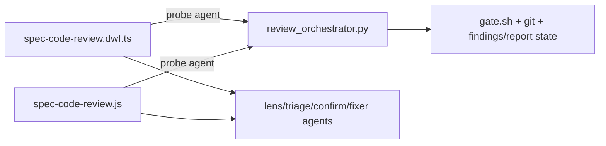

# Tech Spec: code-review-workflow-extraction

**Spec**: [spec.md](spec.md) | **Created**: 2026-10-05
**Every file/symbol citation below must come verbatim from [survey.md](survey.md)
or a grep run in this session — never from memory.**

## Architecture
One stdlib Python oracle owns review state; two thin workflow dialects
orchestrate agents and relay the oracle's JSON. Data flow per phase:
dialect → one probe agent → `review_orchestrator.py <subcommand> --json`
→ JSON back → dialect spawns/relays. The same shape spec-run uses with
`graph.py` (survey S7).

## Solution
### Chosen approach
Extract the shared state logic into `scripts/review_orchestrator.py`
with subcommands (`scope`, `gate`, `shard`, `findings-parse`,
`ids-alloc` is internal state, `report-render`), each emitting the exact
JSON shapes the dialects consume today, then rewrite both dialects as
probe-relay orchestration. Covers FR-001/002 directly; FR-003 follows
because ~1,400 lines per dialect move out; FR-004/005/006 are the
Phase 1/3 safety and governance wraps.

### Alternatives rejected
| Alternative | Why rejected |
|-------------|--------------|
| Generate both dialects from one IR via `workflow-defs.py` | The dialects differ per runtime (typed facade asks vs plain `agent()`), so the IR must model two semantics — a bigger build than the problem (survey S2, S3 raw-diff evidence) |
| Keep twins, add more parity tests | Leaves 4,353 hand-maintained lines unexecutable; treats the symptom (drift) not the cause (duplication) — survey S3, S8 |
| Shrink by deleting features | Behavior is pinned by eval cases E1–E5; deleting to hit a line count inverts the contract |

## Impact analysis
Blast radius: the two workflow files (rewritten), the skill's
`tests/test_workflow_copies.py` (anchors re-pinned to the thin surface),
`tools/tests/test_workflow_runtime.py` (extended), AGENTS.md
(workflow-twins rule), skill CHANGELOG + new ADR, and
`specs/context/structure.md` (module map line). Review *semantics* are
unchanged; installed copies refresh on next `tools/sync.sh`.

## Code guide
### Oracle script
- Touches: `skills/spec-code-review/scripts/review_orchestrator.py`
  (new; sibling of `scripts/gate.sh`, survey S4/S5)
- Approach: argparse subcommands; one `json.dumps` per stdout; reuse
  `gate.sh` via subprocess for the gate family; failure → JSON
  `{"status": "error", ...}` + exit 1 (NFR-004/005)
- Interfaces frozen for Phase 2: `scope --target --base --pr --repo
  --paths --json`; `gate --repo --base --tree --json` (gate.sh rows
  verbatim); `shard --files --budget --json`; `findings-parse --src
  {md,json} --json`; `report --kind review|fix --data @file --json`
- Verify before implementing: `bash skills/spec-code-review/scripts/gate.sh --plan` (JSON shape)
- Pitfalls: keep C-06 stdlib-only; no workflow runtime exists in Python
  tests — subcommands must be pure functions of inputs + repo state

### Dialect rewrites
- Touches: `skills/spec-code-review/workflows/spec-code-review.dwf.ts`,
  `.../spec-code-review.js`
- Approach: delete the extracted helper bodies (survey S2 line ranges);
  replace each with one probe-agent call running the subcommand; keep
  phases, asks, schemas, and agent flows byte-stable where tests pin
  them; update pinned anchors in the same commit
- Verify before implementing: capture today's behavior with
  `python3 tests/test_workflow_copies.py` and the E-case records
- Pitfalls: the Claude dialect has no shell — every script call must
  ride a probe agent (existing pattern, survey S6); do not inline
  fallbacks "just for one field" — that reopens the drift hole (FR-002)

### Execution harness extension
- Touches: `tools/tests/test_workflow_runtime.py`
- Approach: new test class building a real git fixture (init, commit,
  branch, PR-shaped diff), scripting lens/triage/confirm/fixer agents,
  asserting gate-stop behavior, one-wave review, and fix-loop boundary
- Verify before implementing: `python3 tools/tests/test_workflow_runtime.py`
- Pitfalls: fixture repos must be isolated per test (duplicate-ID
  lesson from the spec-run harness work)

## References
No external references — internal precedent is spec-run's oracle
architecture (survey S7); research.md records the deliberate skip.

## Decisions
### D-001: Shared Python oracle over thin dialects, not dialect codegen
- **Context**: 4,353 lines of hand-maintained twins (survey S1), parity
  only by string tests (S3), worst workflow score in the kit (S8);
  spec-run already proves the oracle pattern at 358/320 lines (S7).
- **Decision**: extract shared logic to one stdlib script; dialects keep
  only runtime-native orchestration; behavior contracts stay pinned by
  the existing tests and eval corpus.
- **Consequences**: review logic becomes unit-testable in Python; parity
  surface shrinks to orchestration; a future third dialect implements
  only probes + spawns. Recorded as the skill's next-numbered ADR at
  delivery.
