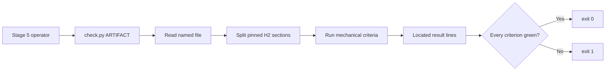

# Tech Spec: brainstorm-handoff-checker

**Spec**: [spec.md](spec.md) | **Created**: 2026-10-05
**Every file/symbol citation below must come verbatim from [survey.md](survey.md)
or a grep run in this session — never from memory.**

## Architecture
One executable Python CLI is the only runtime boundary. It takes one required artifact path, reads that UTF-8 file once, scans it line by line, and emits located criterion results before choosing an exit code. Stage-5 guidance invokes that CLI; it does not embed a second parser.

The script is additive in the surveyed `skills/spec-brainstorming/scripts/` directory, whose only current occupant is `skill-dir.sh`. The existing template and flow-contract sources remain unchanged.

## Solution
### Chosen approach
Create a new `check.py` in the surveyed `skills/spec-brainstorming/scripts/` directory as a stdlib-only, line-oriented Markdown validator. `ARTIFACT` is a required positional argument and is used exactly as named; no default location is inferred.

- FR-001 — find the five exact level-two headings in their pinned order and require non-blank body content in each. The survey pins those headings through `TEMPLATE_SECTIONS = [` in `skills/spec-brainstorming/tests/test_flow_contracts.py`.
- FR-002 — carry the same ten case-sensitive stems currently introduced by `PLACEHOLDER_STEMS = (` and report every raw-line occurrence with its stem and one-based line number.
- FR-003 — inside Direction, require non-empty `Selected`, `Rationale`, and `Rejected` labels; the rejected line must also contain an em dash followed by non-empty reason text.
- FR-004 — inside Core MVP Features, require at least one numbered item with content and a non-empty `Out of scope (day-one cut list)` label whose same-line or continuation content is more than the template ellipsis marker.
- FR-005 — inside Potential Risk Mitigations, require the pinned three-cell table header and, for each data row, non-empty risk, early-warning, and mitigation-or-acceptance cells; require non-empty `Kill criteria` content.
- FR-006 — emit exactly one `FAIL path:line criterion: detail` line per failed result, emit one green line when there are no failures, and return 1 on any failure or unreadable artifact and 0 only when every criterion is green.
- FR-007 — treat the positional path as authoritative, including paths outside `brainstorms/`; check only that it is an existing regular file and readable UTF-8 text.
- FR-008 — emit one deterministic judgment-disclosure line as the final stdout line on every run — green, failing, and unreadable-artifact — with a stable `JUDGMENT:` prefix. It names the pinned criteria the checker does not decide, led by digest-to-artifact dealbreaker mapping per `skills/spec-brainstorming/gates/handoff.md:25` "Every Cynic dealbreaker from the digest appears in the risk" (the digest is not part of the artifact), then the semantic remainders the mechanical checks only approximate: `skills/spec-brainstorming/gates/handoff.md:23` "reason, in the user's terms — the panel's favorite is not the" and `skills/spec-brainstorming/gates/handoff.md:28` "Kill criteria are observable: stated so the evidence could". The line is a static pinned constant, never changes the exit code, and is the output-side half of D-003.
- NFR-004 / NFR-007 — import only the Python standard library, read no environment configuration, and avoid clock, randomness, network, process spawning, and harness APIs.

The CLI output is plain text on stdout. Argument-format errors may use argparse's standard usage behavior; every artifact-validation result is part of the one-line-per-criterion contract.

### Alternatives rejected
| Alternative | Why rejected |
|-------------|--------------|
| Shell and text utilities | Table-cell parsing and stable line-number reporting would depend on utility behavior outside the surveyed stdlib-only constraint |
| Import `PLACEHOLDER_STEMS` from the flow-contract test module | Runtime code would depend on a test module; the survey identifies test code as the current source, not a runtime dependency |
| Add a shared constants module | It would have one production consumer and add a module solely to avoid a pinned duplicate, contrary to reuse-before-writing |
| Broaden placeholder matching beyond the ten pinned stems | The survey records the over-match risk for legitimate angle-bracket content; exact stems keep checker and contract aligned |
| Consume the panel digest to prove dealbreaker coverage | The digest is not part of the artifact, so the survey-supported boundary remains judgment rather than a mechanical claim |

## Impact analysis
The production change is path-scoped and additive. The survey records that `skills/spec-brainstorming/scripts/` contains only `skill-dir.sh`, so no existing checker symbol or direct caller can break. The common name `check` is therefore scoped by full path rather than treated as a fuzzy repository-wide symbol.

`skills/spec-brainstorming/tests/test_flow_contracts.py` remains untouched; its `TEMPLATE_SECTIONS = [` and `PLACEHOLDER_STEMS = (` definitions stay authoritative for template shape, while a new equality assertion in the owner suite pins the checker's duplicate stems to them. Documentation edits affect the stage-five instructions and gate text but preserve their surveyed load-bearing phrases. The existing runner already executes every `tests/test_*.py` file, so the new owner suite enters the same suite without runner changes.

No existing flag, keyword, default, or return shape changes, so there are no old-default assertions, exact-count pins, exact-traffic pins, or behavior pins to reclassify. The relevant guard is the surveyed baseline command: `bash skills/spec-brainstorming/tests/run.sh`.

## Quality, threats, and rollback
| Requirement | Design consequence / threat mitigation | Rollback or verification |
|-------------|----------------------------------------|--------------------------|
| NFR-001 | Not applicable: the only input is a repository file path; the CLI performs no network, secret, or privileged operation | Owner suite exercises the CLI boundary; implementation review confirms imports and calls |
| NFR-002 | Not applicable: no personal or sensitive data is processed beyond the artifact's own content | Read exactly the named file and keep failure details to criterion names, stems, section names, and locations |
| NFR-003 | Not applicable: a single small markdown file has no latency-sensitive path | One file read followed by a linear scan; no directory walk |
| NFR-004 | Deterministic evaluation uses only the supplied bytes and standard-library parsing | Owner suite compares fixed green and invalid fixtures; suite uses `sys.executable`, not a harness command |
| NFR-005 | Not applicable: a green/red CLI answer is the entire output surface | Owner suite asserts result lines and exit codes |
| NFR-006 | Not applicable: no interactive or user-facing UI is touched | argparse accepts one positional path and never prompts |
| NFR-007 | Standard library only and no harness API in the core script | Owner suite and implementation review confirm the import list |
| FR-008 | The judgment disclosure is a static pinned line emitted on every run, so honesty does not depend on the run being green | Owner suite asserts the `JUDGMENT:` line on green and failing runs alike, with digest-to-artifact dealbreaker mapping named first |

External-input threat model: the operator controls `ARTIFACT` and its bytes. The checker reads only that file, does not execute or transform it, emits criterion-level details rather than arbitrary table contents, and exits on unreadable input. Residual risk is local disclosure of the operator-supplied path and a matched placeholder stem, which is the required diagnostic. Rollback is reverting the single PR; there is no persisted state or migration.

## Code guide
### Checker CLI
- Touches: new `check.py` in the surveyed `skills/spec-brainstorming/scripts/` directory
- Approach: keep argument handling, section splitting, criterion checks, result formatting, and exit-code selection in one small script. Internal helper functions may exist, but the CLI is the only interface exposed to callers and tests.
- Verify before implementing: `bash skills/spec-brainstorming/tests/run.sh`
- Pitfalls: preserve the exact ten stems; avoid treating legitimate angle brackets as placeholders; use one-based artifact line numbers; do not prefix or relocate the operator-named path.
- Output invariant: the `JUDGMENT:` disclosure is the final stdout line on every run — green, failing, and unreadable-artifact — and is a pinned constant that never selects the exit code.

### Owner suite
- Touches: new `test_handoff_check.py` under the surveyed `skills/spec-brainstorming/tests/` runner glob
- Approach: invoke the CLI with `subprocess` and `sys.executable`. Use the surveyed green fixture for the exit-0 case and small temporary artifacts for located failures, an operator-named path outside `brainstorms/`, and an invalid path. Pin the checker's placeholder tuple equal to `PLACEHOLDER_STEMS = (` in `skills/spec-brainstorming/tests/test_flow_contracts.py`.
- Verify before implementing: `bash skills/spec-brainstorming/tests/run.sh`
- Pitfalls: keep tests at the CLI boundary instead of importing internal helpers; the runner already discovers the file, so do not modify it.

### Stage-five guidance
- Touches: `skills/spec-brainstorming/SKILL.md`, `skills/spec-brainstorming/gates/handoff.md`, and `skills/spec-brainstorming/contracts/run.md`
- Approach: instruct stage 5 to run the checker on the actual artifact path before naming `/spec`; on failure, fix the artifact and rerun. State that section, placeholder, direction, feature, risk-row, kill-criteria, path, exit-code, and reporting checks are mechanical, while panel-digest-to-artifact dealbreaker coverage remains judgment because the digest is not part of the artifact.
- Verify before implementing: `rg -n "user-named path|Location rules" skills/spec-brainstorming` and `bash skills/spec-brainstorming/tests/run.sh`
- Pitfalls: do not alter the template shape or claim that a green checker proves semantic dealbreaker coverage.

## References
No external references are needed; `research.md` records the deliberate Stage-0 skip.

## Decisions
### D-001: The CLI is the only public checker interface
- **Context**: Parser behavior must be protected without creating exports or wrappers that only tests use.
- **Decision**: Implement one executable script and test it through `subprocess`; internal helpers remain private.
- **Consequences**: Tests cannot couple to helper names, and parser refactors remain safe while the observable CLI contract stays pinned.

### D-002: Duplicate the pinned placeholder stems in the checker
- **Context**: The stems currently live in the flow-contract test module, which runtime code must not import.
- **Decision**: Define the same tuple in the checker and add an owner assertion that it equals the test-module tuple.
- **Consequences**: Two deliberate copies exist, but drift fails the suite; no single-caller shared module is added.

### D-003: Mechanical green never claims digest coverage
- **Context**: Every Cynic dealbreaker must reach the artifact, but the panel digest is not part of the artifact.
- **Decision**: The checker validates only artifact-observable criteria; gate and run guidance explicitly names digest-to-artifact dealbreaker mapping as judgment.
- **Consequences**: A green result is honest about its boundary and the semantic check remains a human review criterion.
