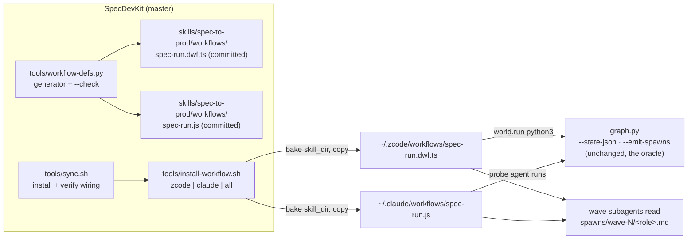

# Tech Spec: dynamic-workflow

**Spec**: [spec.md](spec.md) | **Created**: 2026-09-20
**Every file/symbol citation below must come verbatim from [survey.md](survey.md)
or a grep run in this session — never from memory.**

## Architecture

One source of truth, two emitted dialects, one installer — the repo's
established generated-dialect pattern (omp-defs precedent, survey S7)
applied to workflow scripts instead of agent defs:

Both dialects are thin orchestration loops over the unchanged engine:
`graph.py --state-json` decides everything (nodes, frontier, gates), and
`graph.py --emit-spawns` writes the self-contained payloads the subagents
read (survey S1–S6). Neither dialect re-implements any readiness rule.

## Solution
### Chosen approach
`tools/workflow-defs.py` holds both dialects as constant text templates
(the single representation — D-006) and writes them under
`skills/spec-to-prod/workflows/`; `--check` diffs the committed copies
against a fresh regeneration. `tools/install-workflow.sh` copies each
dialect to its harness root, substituting the `__SKILL_DIR__` placeholder
with the skill copy that root owns (D-002), under the same
provenance-ledger foreign-file discipline sync.sh uses (survey S8
evidence). FR coverage: FR-001/002 = the two emitters + committed files;
FR-003 = the shared loop contract embedded in both templates (pause set
mirroring `skills/spec-to-prod/scripts/graph.py:find_pause:788`, stop
conditions mirroring `skills/spec-to-prod/scripts/graph.py:run_loop:877`);
FR-004 = the installer; FR-005 = the sync wiring; FR-006 = `--check` +
`tools/tests/test_workflow_defs.py`; FR-007 = the doc set.

### Alternatives rejected
| Alternative | Why rejected |
|-------------|--------------|
| One portable "workflow IR" compiled per harness | Two targets only; an IR layer would be a new abstraction with exactly two consumers (CONSTITUTION C-04) — the constant templates ARE the IR |
| Install-time generation (no committed artifacts) | Breaks review/diff discipline and plugin packaging (the repo ships files, not generators, to marketplaces); regenerate-only committed copies match decisions/007 |
| Extend graph.py `--runner` to spawn agents itself | graph.py is stdlib-CLI and harness-neutral; a spawner would drag harness APIs into the oracle — the workflow runtimes are exactly the out-of-process runner `--run` already models (survey S3) |
| omp/Droid/Codex dialects now | No comparable runtime on Droid/Codex this pass; omp already has the documented kernel recipe — deferred with named criteria (ADR-019) |

## Impact analysis
Additive only. `tools/sync.sh` gains a gated block inside the existing
skills loop (worst case: the block skips loudly; the 10 existing sync
tests keep running unchanged). `skills/spec-to-prod/workflows/` is a new
derived dir inside the skill — rsync'd with the tree, never read by
check.py/audit.py (same non-status class as `spawns/`). No existing symbol
changes; graph.py is untouched. The blast radius of a wrong dialect file
is the workflow run refusing to load on its harness — caught by the
invariant tests, not by anything runtime.

## Code guide
### tools/workflow-defs.py
- Touches: new file, modeled on `tools/omp-defs.py:main:155` (argparse,
  --skill-dir/--out, regenerate-only posture)
- Approach: DZF_TS / WF_JS string constants; `write()` +
  `--check` mode; exit 1 on drift/missing
- Verify before implementing: `python3 tools/omp-defs.py --help`
- Pitfalls: the dwf.ts template must contain no `import`/`export`/
  `declare` tokens even in comments (the invariant test greps raw text);
  the .js template must keep `export const meta` as its first statement
  (the meta block is the one allowed export)

### tools/install-workflow.sh
- Touches: new file; reads `skills/*/workflows/*.dwf.ts` (→ zcode) and
  `*.js` (→ claude)
- Approach: target roots per harness; skill_dir resolution order
  (explicit --skill-dir → the target harness's own skills root →
  `~/.agents/skills` compat → other roots), validated against
  the skill's graph.py presence (the file at
  `skills/spec-to-prod/scripts/graph.py`); sed-bake `__SKILL_DIR__`; ledger-guarded
  copy; `--check` verify mode; loud skip when a user-mode harness home is
  absent
- Verify before implementing: `bash tools/sync.sh` (ledger discipline
  reference, survey S8)
- Pitfalls: never `mkdir -p ~/.zcode` in user mode (D-015 fabrication
  rule); a destination that differs but is in the ledger is an overwrite,
  anything else is foreign → refuse

### tools/sync.sh wiring
- Touches: one gated block after the commands install in the skills loop;
  one verify block in the verify loop
- Approach: `[ -d "$skill_dir/workflows" ]` gates everything; calls the
  installer per target with `--skill-dir` pinned to that root's own skill
  copy (`$HOME/.zcode/skills/<name>`, `$HOME/.claude/skills/<name>`),
  each itself gated on the harness home existing
- Verify before implementing: `bash tools/tests/run.sh` (baseline 10/10
  this session)
- Pitfalls: install order — the skill tree lands before the workflow
  block runs, so the baked skill_dir is never a not-yet-installed path

## References
- ADR-010 (graph as dynamic workflow) and ADR-015 (dialect-per-harness
  model) — in-repo precedents, `skills/spec-to-prod/decisions/`
- Session runtime research 2026-09-20 (survey S10): zcode facade surface;
  Claude Code dynamic-workflows docs (script primitives, meta block,
  determinism rules, no-script-fs/shell, resumable runs)

## Decisions
<!-- ADR-lite. Append-only: decisions made during implementation land here too. -->
### D-001: The workflow is named `spec-run`
- **Context**: it needs one name on two harnesses; Claude saved workflows
  run as `/<name>` slash commands and the skill already ships a
  `/spec-to-prod` router plus lifecycle commands — a collision would
  shadow the router.
- **Decision**: `spec-run` in both dialects (files `spec-run.dwf.ts`,
  `spec-run.js`); args carry the spec name.
- **Consequences**: `spec-run <name>`-style invocation; no collision with
  `/spec-to-prod`, `/spec`, or `/ship`; the name is fixed by the
  generator, not per-install.

### D-002: skill_dir is baked at install time; a runtime arg overrides it
- **Context**: both runtimes must reach the skill's graph.py (under skills/spec-to-prod/scripts/) and the briefs;
  the installed workflow may live far from the skill copy; the zcode
  facade can probe the filesystem but the Claude script cannot (no
  fs/shell in script).
- **Decision**: masters carry a literal `__SKILL_DIR__` placeholder; the
  installer seds in the target root's own skill copy
  (`$HOME/.zcode/skills/<name>` / `$HOME/.claude/skills/<name>` /
  project equivalents); both dialects also accept an explicit runtime
  `skill_dir` arg that wins over the baked default.
- **Consequences**: each harness's workflow is self-contained; moving the
  skill without reinstalling surfaces as `--check` drift, repaired by
  one installer run.

### D-003: The Claude dialect routes every shell need through one probe agent; digests are schema-validated
- **Context**: Claude workflow scripts have no filesystem or shell access
  — only subagents do; digests must be machine-shaped for `pipeline`.
- **Decision**: one `graph-state` probe agent per recompute runs
  `graph.py --state-json` / `--emit-spawns` and returns stdout verbatim
  via a `{stdout: string}` schema; wave agents return
  `{status: done|blocked|gap, digest: string}`; the zcode dialect mirrors
  the same shape as a typed interface.
- **Consequences**: one extra cheap agent call per recompute on Claude;
  identical pause/stop semantics across dialects because both parse the
  same oracle output.

### D-004: Branch + clean-tree before-audit gates waived for this build (ruling)
- **Context**: the before-audit's gate 3 (clean tree) and gate 5
  (isolated branch) assume a fresh checkout; this spec is built in-place
  in the authoring session at the user's explicit "làm luôn" instruction.
- **Decision**: build on the current tree; the single end-of-plan commit
  is deferred to an explicit user request; gates 1, 2, 4, 6 ran for real
  (precondition check, baseline suites green, already-done sweep,
  constitution filled).
- **Consequences**: the scope diff at the closing audit anchors on
  `cd62be80…` plus the `specs/` scaffold rather than a fresh branch HEAD;
  the closing-audit scope command must account for that.

### D-005: Fixed literal phase names in the zcode dialect
- **Context**: the zcode facade requires compile-time-literal `phase()`
  names; wave counts are runtime state, so dynamic wave titles cannot be
  phase names there (Claude's `phase(title)` has no such constraint).
- **Decision**: the dwf.ts uses three literal phases — "Read doc state and
  check the human gates", "Run the ready wave", "Recompute and summarize"
  — the loop's iterations continue the same-named phase; the .js may use
  dynamic `Wave N` titles.
- **Consequences**: the zcode phase graph shows the loop's three stages,
  not one node per wave; wave identity rides the `log()` lines and the
  returned summary instead.

### D-006: Committed regenerate-only artifacts with generator --check
- **Context**: two dialects must not drift from each other or from
  hand-edits; the repo already answers this shape (decisions/007,
  checklist.md, omp defs).
- **Decision**: the generated files are committed under
  `skills/spec-to-prod/workflows/`, never hand-edited;
  `tools/workflow-defs.py --check` (and the unit suite) enforces
  regeneration equality.
- **Consequences**: one edit point (the generator); marketplace/plugin
  packaging ships real files; sync's tree verify covers them as part of
  the skill tree automatically.

### D-007: Closing-audit adjudications (scope · clean · proofs cap)
- **Context**: the closing audit's mechanical passes flagged findings
  that need a ruling: 4 changed files UNMENTIONED by literal path in
  task.md; 6 "debug print" suspects in tools/workflow-defs.py; TC-010's
  proof timing out at audit.py's 120s run cap.
- **Decision**: (scope) `README.md`, `skills/spec-to-prod/CHANGELOG.md`,
  `skills/spec-to-prod/decisions/019-dynamic-workflow-dialects.md`, and
  `skills/spec-to-prod/.claude-plugin/plugin.json` are T005's named
  deliverables — named by intent in the entry, not by literal path, so
  the scope grep cannot see them; legitimate, kept. (clean) the six
  suspects are the generator's designed CLI output (OK/DRIFT/--list/
  wrote lines, mirroring omp-defs.py's own CLI prints), not debug
  residue; kept. (proofs) TC-010's command (bash tools/tests/run.sh)
  exceeds the audit's 120s per-command cap at ~140s — rerun standalone
  this session, exit 0 with output on record; the timeout is a runtime
  cap, not a correctness verdict (audit.py's own wording).
- **Consequences**: none of the three is a defect; if run.sh ever grows
  past ~2× the cap, bound its corpus or split it rather than relying on
  standalone reruns.
